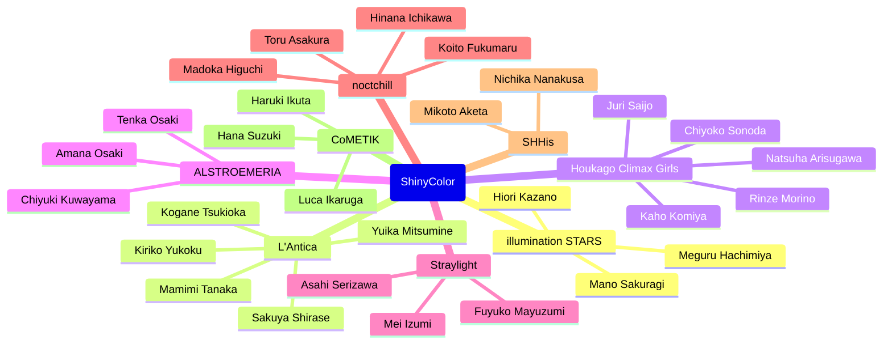
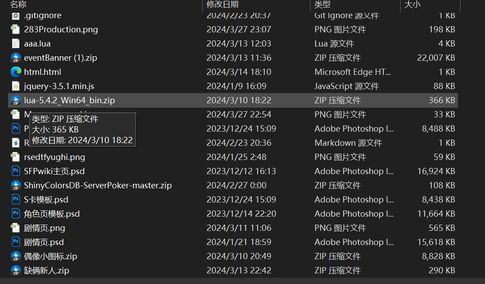
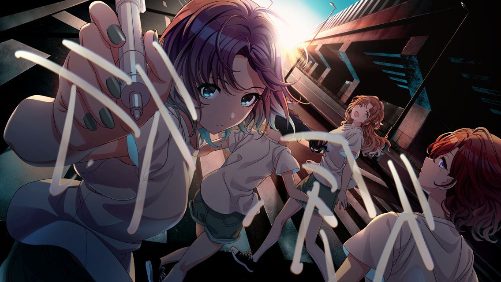

Do I have anything left?

{/* truncate */}

## Some shit talks
Alright. I have to claim that this blog is not tasteful and nutritious. So if any of you want to see some valuable pages, you should quit right now.

Good, then, I do admitted that I am still haunted by my next tofel exam. ETO is like a bitch, scraping my heart and brain everyday.

Therefore, I write this blog in English not because I want to, but I have to. There is a voice in my head keep telling me I need to do something related to English, or I will undoubtfully fail in the next round.

## Why this essay comes into existence
Well, there are still something worth doing within this reluctant blog.

  
You know what?

  I want to GPT my paragraphs in order to judge whether or not my grammar is right. 

  But Kimi has been disconnected 4 times and tells me my network is down. 

  Meanwhile, my codegeex agent integrated in vscode is working fine right now. 

  So Kimi is a bitch.

  

You know what???

    "is a bitch" is automatically filled by codegeex! laugh out of my ass....
    So for the sake of such a smart agent, i decide to find some emoji to express my happiness right now.
    🤣🤣🤣🤣  

[emojis](https://www.emojiall.com/zh-hans/emoji/%F0%9F%A4%A3)

Alright, let's get back to the topic. What are worthy of doing?

**
Translation of all girls' names.
**

Sound stupid, but utilitarian. 

Because of an obivious reason, Lao Wai cannot understand the girls' names in my language. But it is no denying that tremendous amount of them do watch animates, which means I can cut in the conversation through this topic.

Most importantly, it is not as evil as how brutal world and competition does, right?

## Girls, groups and relations

_I won't tell you that the primary reason of writing this page is trying out mermaid._

:::info
The theme colors here are all wrong. But I cannot figure out how to stylize mermaid. 

But I promise I will come back and correct it someday.
:::

- illumination STARS
  - Mano Sakuragi (CV: Hitomi Sekine)
  - Hiori Kazano (CV: Reina Kondou)
  - Meguru Hachimiya (CV: Mayu Mineda)
- L'Antica
  - Kogane Tsukioka (CV: Karin Isobe)
  - Mamimi Tanaka (CV: Chisa Suganuma)
  - Sakuya Shirase (CV: Anna Yamaki)
  - Yuika Mitsumine (CV: Runa Narumi (2018-2021), Shio Kisui (2021-onwards))
  - Kiriko Yukoku (CV: Mizuki Yuina)
- Houkago Climax Girls
  - Kaho Komiya (CV: Hiyori Kouno)
  - Chiyoko Sonoda (CV: Haruka Shiraishi)
  - Juri Saijo (CV: Mariko Nagai)
  - Rinze Morino (CV: Wakana Maruoka)
  - Natsuha Arisugawa (CV: Akiho Suzumoto)
- ALSTROEMERIA
  - Amana Osaki (CV: Honoka Kuroki)
  - Tenka Osaki (CV: Ryouko Maekawa)
  - Chiyuki Kuwayama (CV: Noriko Shibasaki)
- Straylight
  - Asahi Serizawa (CV: Yuki Tanaka)
  - Fuyuko Mayuzumi (CV: Eri Yukimura)
  - Mei Izumi (CV: Sayaka Kitahara)
- noctchill
  - Toru Asakura (CV: Yuu Wakui)
  - Madoka Higuchi (CV: Rio Tsuchiya)
  - Koito Fukumaru (CV: Saran Tajima)
  - Hinana Ichikawa (CV: Miho Okasaki)
- SHHis
  - Nichika Nanakusa (CV: Azusa Shizuki)
  - Mikoto Aketa (CV: Aya Yamane)
- CoMETIK
  - Luca Ikaruga (CV: Rina Kawaguchi)
  - Hana Suzuki (CV: Haruna Mikawa)
  - Haruki Ikuta (CV: Rena Ozawa)

I am tired now. I have wrote this page for 2h...

At first, emoji webside, connection lagging, and then, stupid Claude, uncustomisable mermaid. Oh my gosh...

I have tons of pictures and voices about them, but today I shall get no time to share.

So now, it is time to narrate my story.

## BWiki I worked for before

In 2023/7-2024/4, I Joined in and worked for a team, which is built up by community members. 

We create our website and deploy it on [BWiki](https://wiki.biligame.com/) service, sharing some game strategies.

The [**Enza ShinyColor**](https://shinycolors.enza.fun/home) is a fully browser-based Japenese game. As a new comer, there is no doubt that you will be dazzled by massive items, characters, stories, cards, properties and their interactions. So we created a website, which is a wiki, to help people to navigate through the game.

The only motivation of us is to make ShinyColor better, more acceptable by more people.

**Not only are we obsessed by girls, but we are also obsessed by the game, by our era.**

This was one of the most happy times in my life. I wrote code for frontend, using jquery, making synergy with artist members. They created photoshop file and deliver to me. And I created webpages according to that.

Although I was not a good frontend programmer then, I still build everything up and be proud of that.

For all my readers, you still have access to the websides, both [Enza](https://wiki.biligame.com/shinycolors/%E9%A6%96%E9%A1%B5) and [Song for Prism](https://wiki.biligame.com/imasscsfp/%E9%A6%96%E9%A1%B5)

When it comes to my favorate part, I must take out [**table of all stories**](https://wiki.biligame.com/shinycolors/%E5%89%A7%E6%83%85%E6%95%B4%E7%90%86%E9%A1%B5). I wrote each line of code. It was created in a hasty way, full of trash code, but it has functioned well up to now. 

The memory of that period is as clear as it happened yesterday. I am sured I will cherish it.

## The golden age don't last long

Due to some inevitable reasons, our team disbanded.

The main cause is the leader of us had been criticized by the outside-world community, aka **Chinese residing abroad**.

> "You are making ShinyColor family filled with kids and basterds."

> "You've broken the peace in our little community."

> "A real fan won't do such thing like what you do."

The leader took it all, just told us they were jealous of us.

But after all, he still wanted to fit in the community. He had been there for 8 years, since he was graduated from college.

**It is his youth.**

And he decided to quit, finally. He relinquished his authority of website edition to another big brother in our team.

Disappeared.

Along with my golden age.

_Community lasts, I fade away._