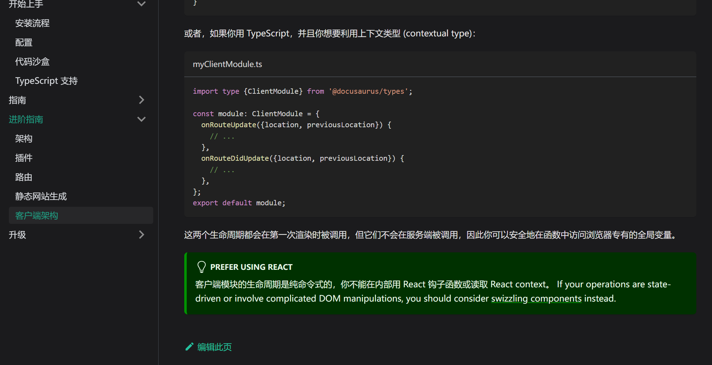
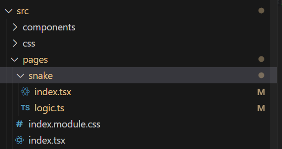
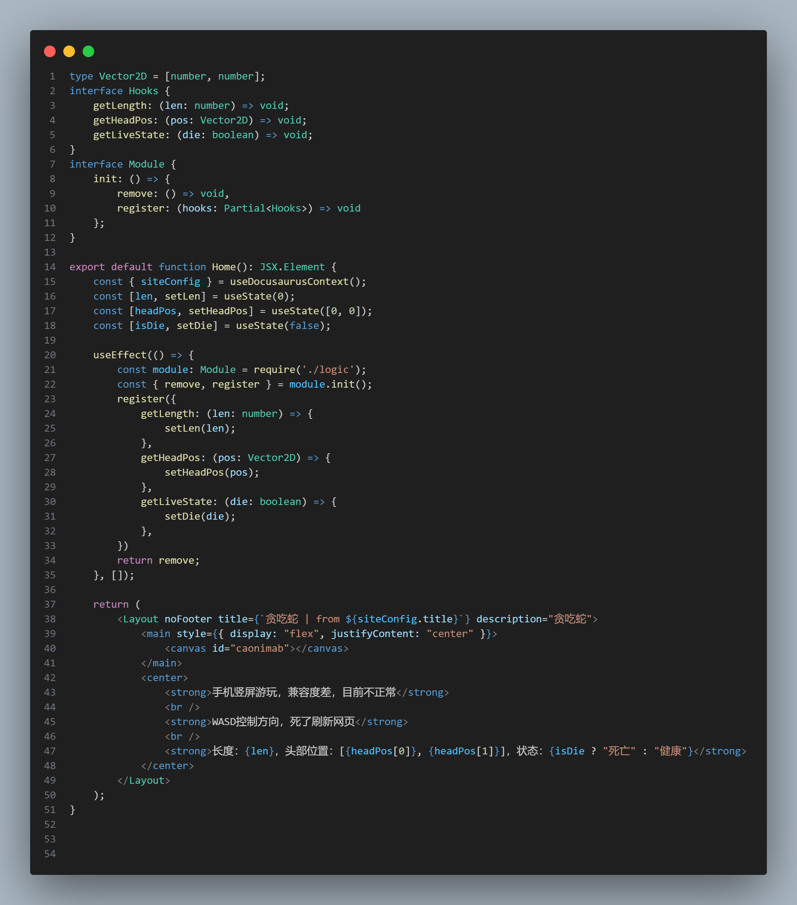
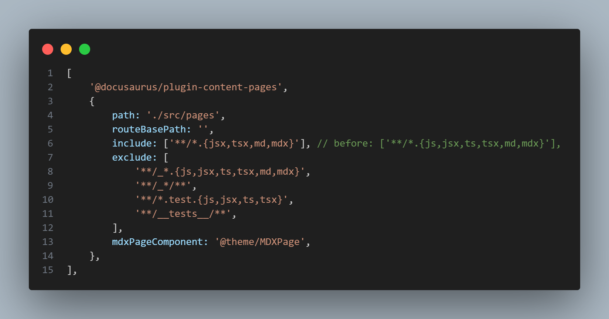

# docusaurus客户端代码正常打开方式

<!-- truncate -->

## 官方描述

如果你使用这个文档里的方法，你会被麻烦死

而且他报错很有误导性

## 我的情况

[点击游玩](/snake)

贪吃蛇小游戏，代码和组件放在page下面了，但是logic本身全部是client code，所以不能直接引入

你现在可能会说：

> 你没使用`<BrowserOnly>`  

> 你没使用`ExecutionEnvironment`  

我现在告诉你这个代码没错，可以编译通过

解决方法是：

是的，**默认情况下ts文件和js文件算client module**。

你把他去掉就没事了...

