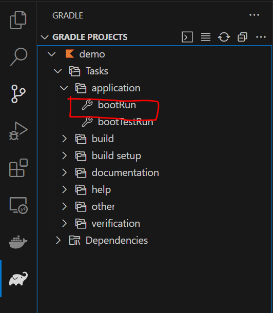

# spring guide recording

## 一，Building a RESTful Web Service

vscode打开空文件夹，打开[start.spring.io](https://start.spring.io)，搞出一套template。

复制粘贴如下两个文件：

1. Greeting.java
2. GreetingController.java

vscode下载gradle插件，点击这个：

可访问`http://localhost:8080/greeting?name=User`和`http://localhost:8080/greeting`进行测试。

## 二，Scheduling Tasks

在application头上加一条`@EnableScheduling`

加一个文件`ScheduledTasks.java`，哪里红了点哪里（补全依赖）。

然后点击bootrun开始测试，可见每五秒打印一条信息

optional `ScheduledTasksTest.java`，我看依赖还不少，没弄

## 三，Consuming a RESTful Web Service

成功了，但是这个章节跟前面不连续，不写了

## 四，