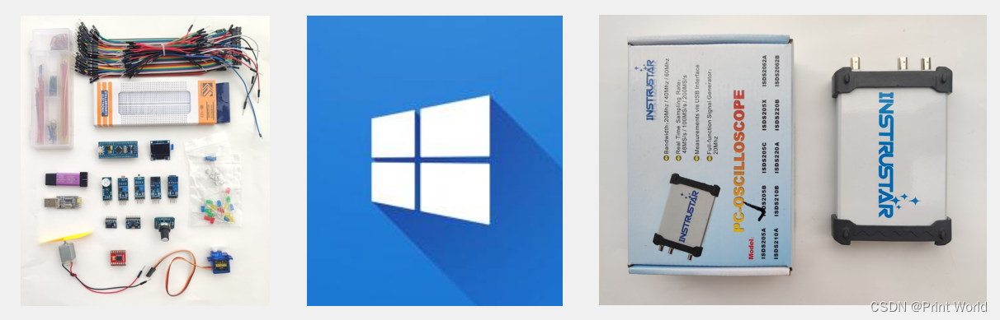

原文链接：[csdn](https://blog.csdn.net/u010249597/article/details/134758736)

## 01. 课程简介
+ 程序纯手打，手把手教学
+ STM32最小系统板+面包板硬件平台

> 该平台比较适合高校在校大学生学习STM32。

## 02. 硬件设备
+ STM32最小系统+面包板
+ Windows10操作系统
+ 万用表、示波器、镊子、剪刀等

## 03. 软件工具
Keil5 MDK

## 04. 硬件套件

### 4.1 面包板和跳线/飞线

### 4.2 杜邦线和STM32最小系统板

### 4.3 STLINK和OLED显示屏

### 4.4 LED和按键

### 4.5 电位器和蜂鸣器

### 4.6 传感器和旋转编码器

### 4.7 USB转串口和MPU6050

### 4.8 Flash闪存和电机模块

### 4.9 SG90舵机

## 05. 配件清单

## 06. 附录
参考：https://jiangxiekeji.com/tutorial.html
参考: [【STM32】江科大STM32学习笔记汇总](https://blog.csdn.net/u010249597/article/details/134762513)