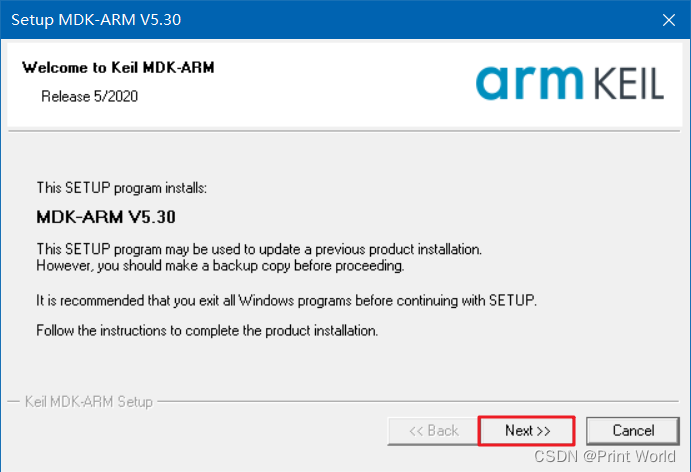

原文链接：https://blog.csdn.net/u010249597/article/details/134765079

## 01. MDK安装
+ MDK 源自德国的 KEIL 公司，是 RealView MDK 的简称。在全球 MDK 被超过 10 万的嵌入式开发工程师使用。目前最新版本为：

+ MDK6，该版本使用 uVision5 IDE 集成开发环境，是目前针对 ARM 处理器，尤其是 Cortex M 内核处理器的最佳开发工具。

+ MDK5 向后兼容 MDK4 和 MDK3 等，以前的项目同样可以在 MDK5 上进行开发(但是头文件方面得全部自己添加)， MDK5 同时加强了针对 Cortex-M 微控制器开发的支持，并且对传统的开发模式和界面进行升级，MDK5 由两个部分组成：MDK Core 和 Software Packs。其中，Software Packs 可以独立于工具链进行新芯片支持和中间库的升级。

### 1.1 双击MDK530.EXE文件，点击Next

1.2 接受许可协议，点击Next

1.3 选择软件安装路径，点击Next

1.4 随便填写信息，然后点击Next

1.5 安装过程中

1.6 选择安装

1.7 点击Finish

1.8 全部点击右上角X关掉即可

1.9 选择是

至此Keil MDK-ARM就安装完成，可以新建工程使用了。但为了不受编译代码4K大小限制和用户体验，就需要购买授权，或注册。

02. Keil5注册
2.1 以管理员的方式运行keil软件

2.2 选择否即可

2.3 打开注册管理窗口（File -> License Management），并复制CID。

2.4 打开注册机，执行如下几步。

2.5 将注册码添加到注册窗口中

03. 支持包安装
3.1 双击Keil.STM32F1xx_DFP.2.2.0.pack

3.2 选择Finishu，完成安装

04. ST-LINK驱动安装
4.1 默认STM32 STLink是没有驱动的，需要安装驱动

4.2 找到Keil安装目录下，安装64位驱动

D:\Keil_v5\ARM\STLink\USBDriver

4.3 选择下一页

4.4 点击完成即可

4.5 驱动安装好之后，黄色感叹号消失，表示安装成功

05. USB转串口驱动
5.1 双击CH341SER.EXE，点击安装

5.2 点击确定

5.3 安装好驱动之后，通过设备管理器查看如下图所示

06. 附录
参考: 【STM32】江科大STM32学习笔记汇总
