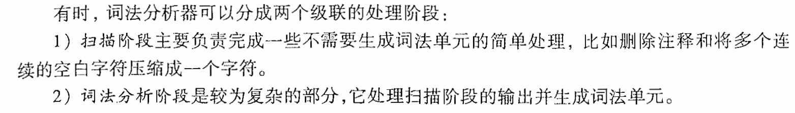
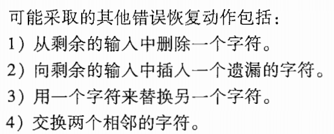
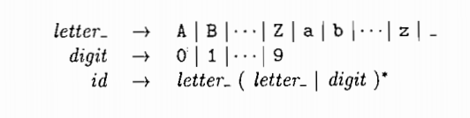
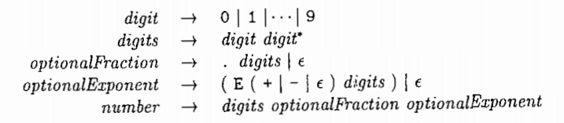
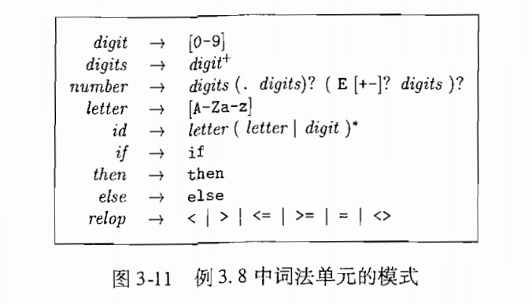
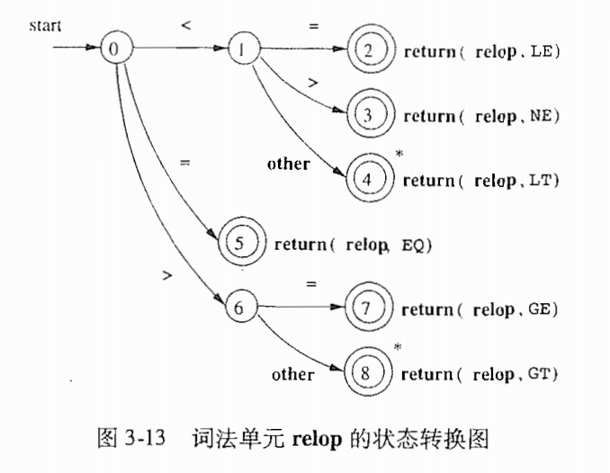
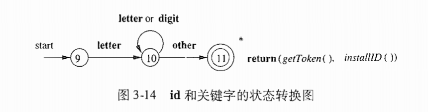
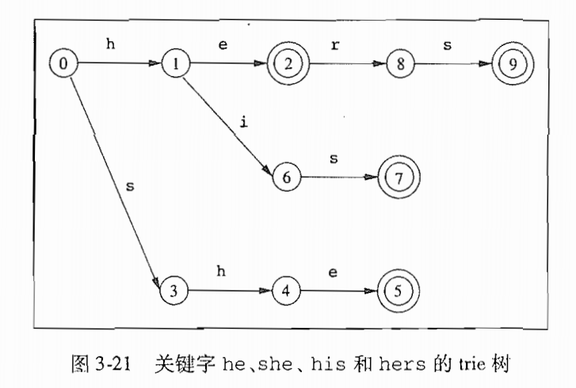
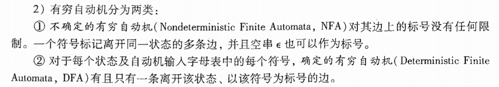
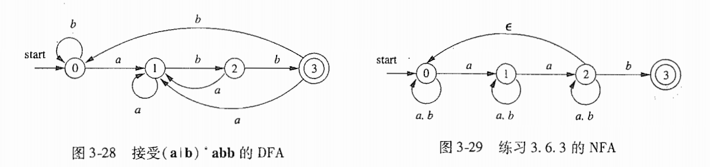

> 看书看不懂，不记笔记彻底死，于是有了这个文件夹

## 3.1 词法分析器作用
+ 读取源程序，过滤空白和注释
+ 错误信息和源程序位置的连接
+ 宏的预处理

这个理解很好

扫描阶段（scanner）和词法分析阶段（lexer）

### 3.1.1 词法分析和语法分析
词法分析跟语法分析分离开来的意义是：
+ 简化设计（过滤注释，不让其进入语法分析器）
+ 并行读取，缓冲技术，加速
+ 可移植性，跨平台相关的东西可以被限制在词法分析中

### 3.1.2 词法单元，模式，词素
+ 词法单元，Tokens

A Token is a pair consisting of a token **name** and an optional attribute **value**

+ 模式，Patterns

a description of the form that the lexemes of a token may take

+ 词素，Lexemes

a sequence of characters in the source program that matches the pattern for a token

具体而言就是实际代码里扫描出来的对应字符串

### 3.1.3 词法的元的属性
 
多个词素可以匹配同样模式，所以需要另加属性来区分，一般是字面量之类的。

### 3.1.4 词法错误 
在实践中，词法分析器不负责识别错误语法，但是如果他匹配不到任何一种合法的token，一般直接panic，或者有闲的蛋疼的方式来进行“尝试修复”，如下：

<!-- ### 3.1.5 练习 -->

## 3.2 输入缓冲
这一节讨论“加速源程序读入”。
因为，比如“-”也可能是"->"的前导，所以我们必须往后读/往前读。

### 3.2.1 缓冲区对
两个指针，第一个指针（lexemeBegin）象征词素的开始，第二个指针（forward）一直向后移动，直到找到匹配的模式。

### 3.2.2 哨兵标记
forward指针的优化策略，缓冲区哨兵标记，如果指针到达哨兵标记，仍然停止，不必等待缓冲区eof。

不过似乎现代编译器缓冲区巨大无比，没哨兵标记什么事了？

## 3.3 词法单元的规约
正则表达式是识别模式的利器。
（搞笑的是这里有一大段在讨论缓冲区是否会用完，举了个例子的java的跨行字符串）

### 3.3.1 串和语言
几个概念：
+ 串，String
+ 字符串，String
+ 字符集，Alphabet
+ 语言，Language
+ 前缀
+ 后缀
+ 字串
+ 真子串
+ 子序列（中间挖掉n个字符，但总体仍然有序） 

### 3.3.2 语言上的运算
并，连接，闭包（离散数学）

### 3.3.3 正则表达式
代数定律（离散数学again）

### 3.3.4 正则定义
$d_{i} \rightarrow r_{i}$
+ $d_{i}$ 是一个词法单元的名字
+ $r_{i}$ 是一个正则表达式，描述了词素的模式

这俩例子很简单：

### 3.3.5 正则表达式的扩展
+ $r^{+} = rr^{*}$
+ $r? = r | ε$
+ $[abcd] = a|b|c|d$

<!-- ### 3.3.6 练习 -->

### 3.4 词法单元的识别

### 3.4.1 状态转换图
需要简单自动机理论知识
+ 状态转换图，State Transition Diagram
+ 起始状态，Start State
+ 终止状态，Final State（接收状态）
+ 状态转换，State Transition
+ 输入符号，Input Symbol
+ 状态转换表，State Transition Table

### 3.4.2 保留字和标识符的识别

### 3.4.3 完成我们的例子
给了个无符号整数的转换图

### 3.4.4 基于状态转换图的词法分析器的体系结构
更好的办法：把所有转换图合并成一个，共用开始状态。

### 3.4.5 练习
trie：前缀树

### 3.5 词法分析器生成工具Lex
### 3.5.1 Lex的使用
### 3.5.2 Lex程序的结构
### 3.5.3 Lex中的冲突解决
+ 选择最长的前缀
+ 选择最早定义的模式
### 3.5.4 向前看运算符
### 3.5.5 练习

### 3.6 有穷自动机FA
finite automata

### 3.6.1 不确定的有穷自动机NFA
+ 空串可以作为转换标号
+ 多个转换标号可以对应同一个转换边
### 3.6.2 转换表

### 3.6.3 自动机中输人字符串的接受
### 3.6.4 确定的有穷自动机DFA
+ 空串不能做转换标号
+ 标号和边 一 一 对应
<!-- ### 3.6.5 练习 -->

### 3.7 从正则表达式到自动机
因为NFA可接受的情况太多太复杂，不如DFA直接，所以我们要把NFA转化成DFA
### 3.7.1 从NFA到DFA的转换

### 3.7.2 NE的模拟
### 3.7.3 NFA模拟的效率
### 3.7.4 从正则表达式构造NFA
### 3.7.5 字符串处理算法的效率
### 3.7.6 练写

### 3.8 词法分析器生成工具的设计
### 3.8.1 生成的词法分析器的结构
### 3.8.2 基于NFA的模式匹配106
### 3.8.3 词法分析器使用的DFA107
### 3.8.4 实现向前看运算符
### 3.8.5 练习

### 3.9 基于DFA的模式匹配器的优化
### 3.9.1 NFA的重要状态
### 3.9.2 根据抽象语法树计算得到的函数
### 3.9.3 计算 nullable、firstpos 以及lastpos
### 3.9.4 计算 followpos
### 3.9.5 根据正则表达式构建DFA
### 3.9.6 最小化一个DFA的状态数
### 3.9.7 词法分析器的状态最小化
### 3.9.8 DFA模拟中的时间和空间权衡
### 3.9.9 练习

### 3.10 第3意总结

### 3.11第3章参考文献119

