原文链接：[csdn](https://blog.csdn.net/u010249597/article/details/134762381)

## 01. STM32简介
+ STM32是ST公司基于ARM Cortex-M内核开发的32位微控制器
+ STM32常应用在嵌入式领域，如智能车、无人机、机器人、无线通信、物联网、工业控制、娱乐电子产品等
+ STM32功能强大、性能优异、片上资源丰富、功耗低，是一款经典的嵌入式微控制器

### 1.1 STM32是什么
STM32是一系列由ST Microelectronics（意法半导体公司）推出的微控制器(MCU)。这些微控制器基于ARM Cortex-M架构，并且提供各种不同的封装和引脚配置。STM32系列中一些受欢迎的微控制器包括STM32F103，STM32F407和STM32F429。 STM32微控制器以其低功耗，高性能和广泛的功能而闻名。它们通常用于物联网设备，可穿戴技术和其他需要低功耗和高性能的应用。 总体而言，STM32微控制器是许多开发人员的首选，因为它们的多功能性，可靠性和广泛的功能。

> ST：指意法半导体  
> M：指定微处理器  
> 32：表示计算机处理器位数  

【官方描述】

> STM32 is a family of microcontrollers from STMicroelectronics, a multinational semiconductor company. STM32 chips are used in a wide range of applications, from simple microcontroller-based projects to complex systems for industrial and automotive use. STM32 chips are based on the ARM Cortex-M architecture and are available in a variety of different packages and pin configurations. Some popular STM32 chips include the STM32F103, STM32F407, and STM32F429 microcontrollers. STM32 chips are known for their low power consumption, high performance, and wide range of features. They are often used in IoT (Internet of Things) devices, wearable technology, and other applications where low power consumption and high performance are critical. Overall, STM32 chips are a popular choice for many developers due to their versatility, reliability, and wide range of features.

【MCU】

> **MCU**：微控制器单元（MicroController Unit）：是把中央处理器、存储器、定时/计数器（timer/counter）、各种输入输出接口等都集成在一块集成电路芯片上的微型计算机。

### 1.2 STM32应用领域
STM32的应用领域包括但不限于：

1. 嵌入式领域：如智能车、无人机、机器人、无线通信、物联网、工业控制、娱乐电子产品、医疗设备、智能家居等。
2. 高速数据采集系统：使用STM32连接高速ADC和FPGA芯片，实现对高速信号的采集和处理，例如高速摄像头、高速激光测距仪等。
3. 自动驾驶控制系统：使用STM32连接多个传感器和执行器，例如摄像头、雷达、电机、电子罗盘等，并通过算法设计和优化，实现自动驾驶控制功能。
4. 机器人视觉系统：使用STM32连接多个摄像头和处理模块，例如OpenCV、CUDA等，并通过算法设计和优化，实现机器人的视觉导航、物体识别等功能。
5. 网络安全嵌入式设备：使用STM32连接加密模块和网络模块，实现网络安全通信和数据加密等功能，例如VPN、防火墙、数据加密存储等。
6. 人工智能嵌入式设备：使用STM32连接AI模块，例如人脸识别、语音识别、自然语言处理等，并通过编程和训练，实现智能化的应用，例如智能门禁、智能家居等。

总的来说，STM32在各个领域都有广泛的应用。

### 1.3 STM32命名规则
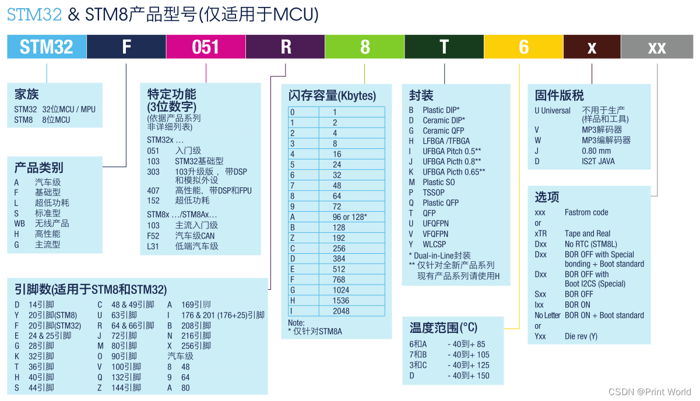

### 1.4 STM32选型
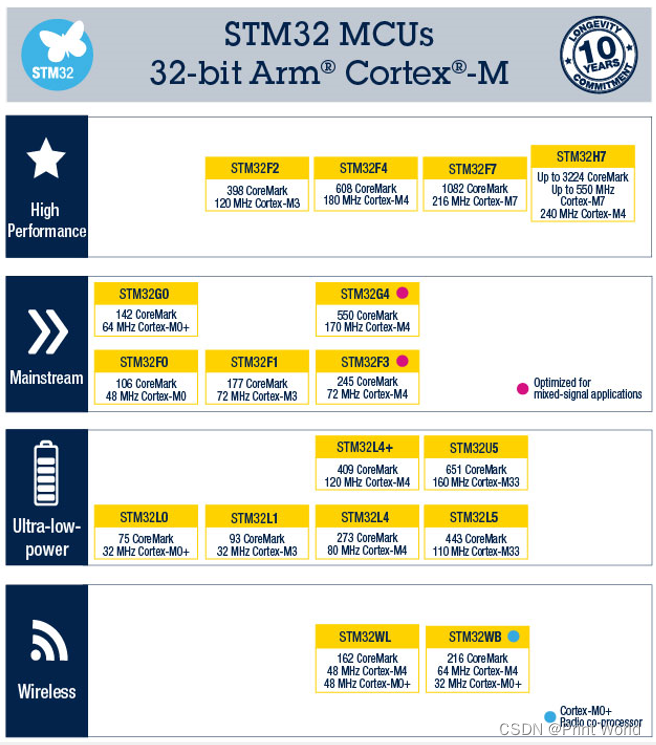
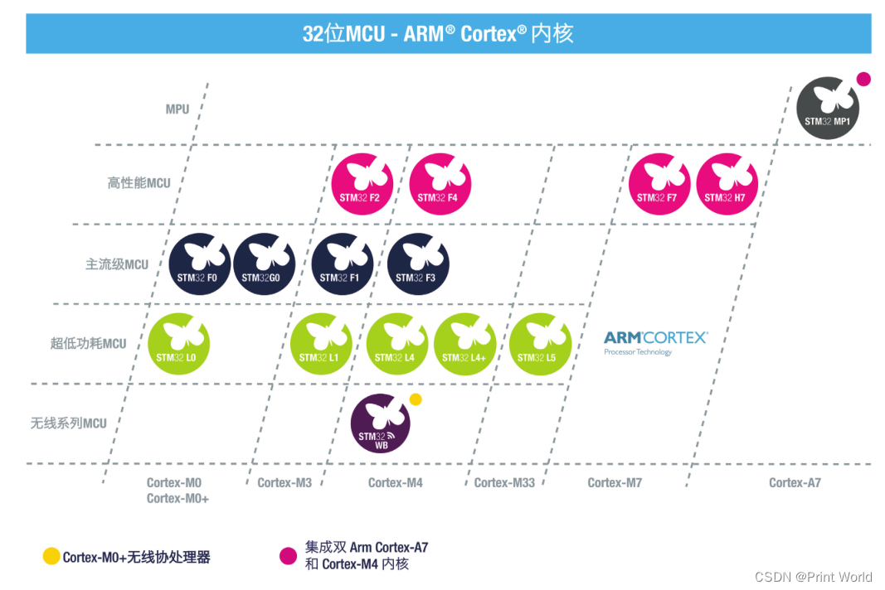

## 02. ARM简介
+ ARM既指ARM公司，也指ARM处理器内核
+ ARM公司是全球领先的半导体知识产权（IP）提供商，全世界超过95%的智能手机和平板电脑都采用ARM架构
+ ARM公司设计ARM内核，半导体厂商完善内核周边电路并生产芯片

### 2.1 ARM是什么
+ ARM既可以认为是一个公司的名字 ，也可以认为是对一类处理器的统称 ，还可以认为是一种技术的名字 。
+ ARM公司是专门从事基于RISC技术芯片设计开发 的公司，作为知识产权供应商，本身不直接从事芯片生产，而是转让设计许可 ，由合作公司生产各具特色的芯片。
+ ARM处理器的内核是统一的 ，由ARM公司提供，而片内部件则是多样的 ，由各大半导体公司设计，这使得ARM设计嵌入式系统的时候，可以基于同样的核心，使用不同的片内外设 ，从而具有很大的优势。

### 2.2 ARM系列
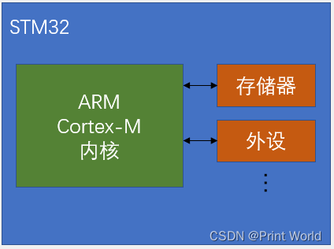

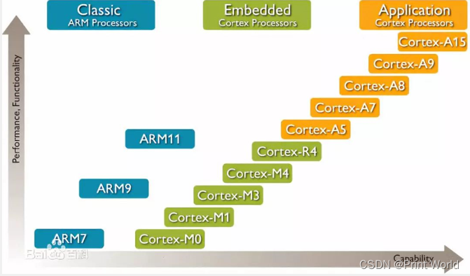

## 03. STM32开发板
### 3.1 MCU简介
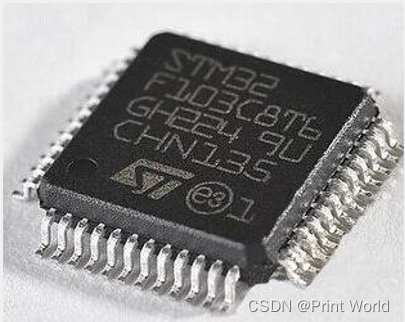

STM32F103C8T6

+ 系列：主流系列STM32F1
+ 内核：ARM Cortex-M3
+ 主频：72MHz
+ RAM：20K（SRAM）
+ ROM：64K（Flash）
+ 供电：2.0~3.6V（标准3.3V）
+ 封装：LQFP48

### 3.2 STM32开发板
STM32硬件：STM32F103C8T6最小系统板
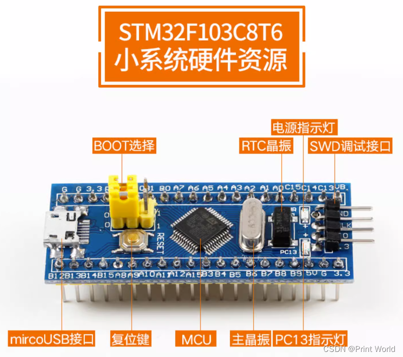

### 3.3 STM32硬件资源
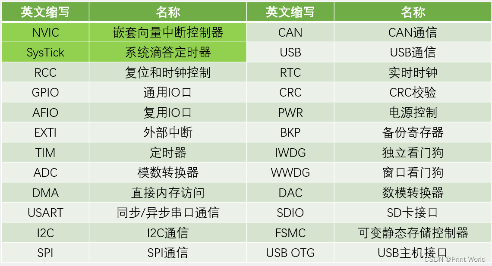

### 04. STM32系统架构
在小容量、中容量和 大容量产品中，主系统由以下部分构成：
● 四个驱动单元：
─ Cortex™-M3内核DCode总线(D-bus)，和系统总线(S-bus)
─ 通用DMA1和通用DMA2
● 四个被动单元
─ 内部SRAM
─ 内部闪存存储器
─ FSMC
─ AHB到APB的桥(AHB2APBx)，它连接所有的APB设备

这些都是通过一个多级的AHB总线构架相互连接的，如下图所示：
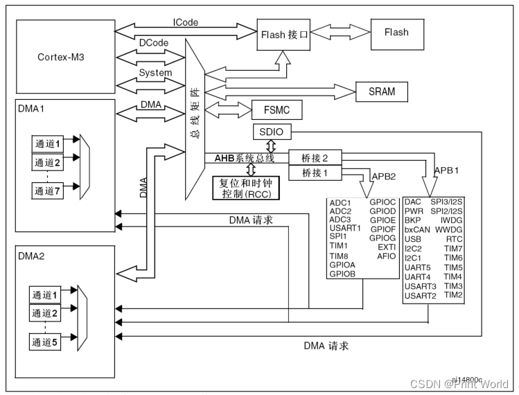

### 05. STM32引脚定义
引脚图

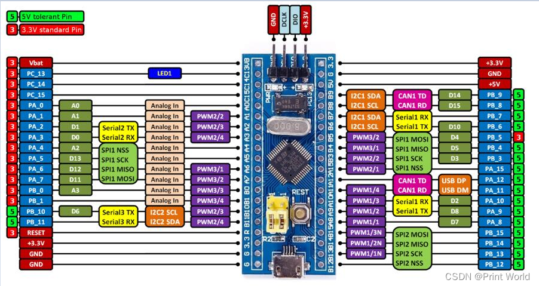

STM32F103C8T6引脚定义

1. I = 输入，O = 输出，S = 电源， HiZ = 高阻
2. FT：容忍5V
3. 可以使用的功能依选定的型号而定。对于具有较少外设模块的型号，始终是包含较小编号的功能模块。例如，某个型号只有1个SPI和2个USART时，它们即是SPI1和USART1及USART2。
4. PC13，PC14和PC15引脚通过电源开关进行供电，而这个电源开关只能够吸收有限的电流(3mA)。因此这三个引脚作为输出引脚时有以下限制：在同一时间只有一个引脚能作为输出，作为输出脚时只能工作在2MHz模式下，最大驱动负载为30pF，并且不能作为电流源(如驱动LED)。
5. 这些引脚在备份区域第一次上电时处于主功能状态下，之后即使复位，这些引脚的状态由备份区域寄存器控制（这些寄存器不会被主复位系统所复位）。 关于如何控制这些IO口的具体信息，请参考STM32F10xxx参考手册的电池备份区域和BKP寄存器的相关章节。
6. 与LQFP64的封装不同，在TFBGA64封装上没有PC3，但提供了V REF+ 引脚。
7. 此类复用功能能够由软件配置到其他引脚上(如果相应的封装型号有此引脚)，详细信息请参考STM32F10xxx参考手册的复用功能I/O章节和调试设置章节。
8. VFQFPN36封装的引脚2和引脚3、LQFP48和LQFP64封装的引脚5和引脚6、和TFBGA64封装的C1和C2，在芯片复位后默认配置为OSC_IN和OSC_OUT功能脚。软件可以重新设置这两个引脚为PD0和PD1功能。但对于LQFP100/BGA100封装，由于PD0和PD1为固有的功能引脚，因此没有必要再由软件进行重映像设置。更多详细信息请参考STM32F10xxx参考手册的复用功能I/O章节和调试设置章节。在输出模式下，PD0和PD1只能配置为50MHz输出模式。

## 06. STM32启动配置
在STM32F10xxx里，可以通过BOOT[1:0]引脚选择三种不同启动模式。
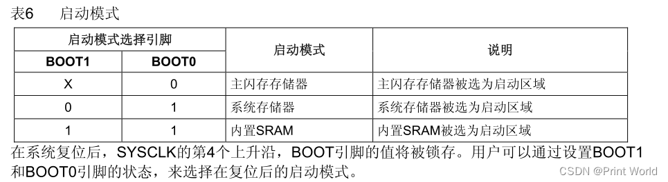

## 07. STM32最小系统电路
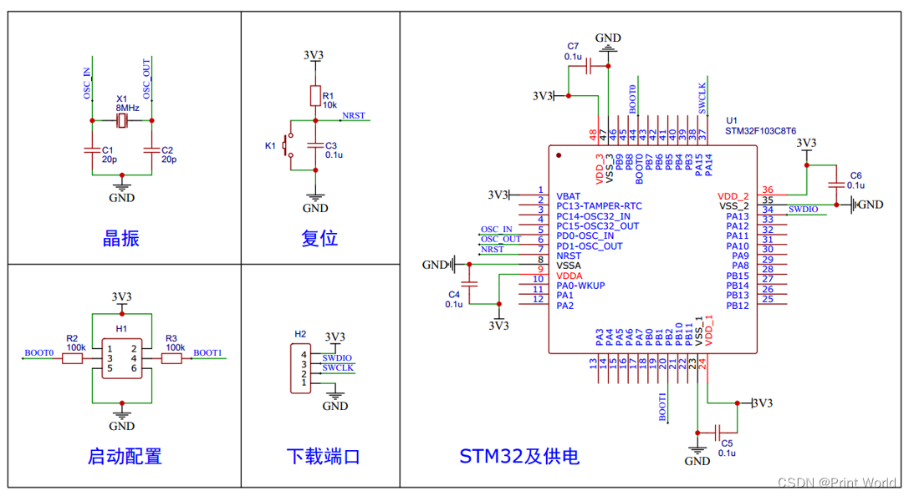

## 08. 附录
参考: [【STM32】江科大STM32学习笔记汇总](https://blog.csdn.net/u010249597/article/details/134762513)