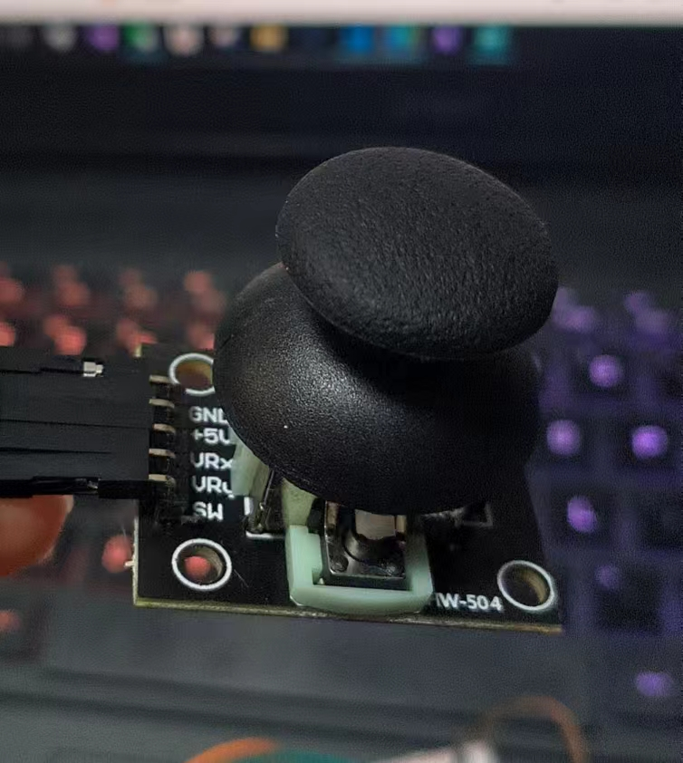
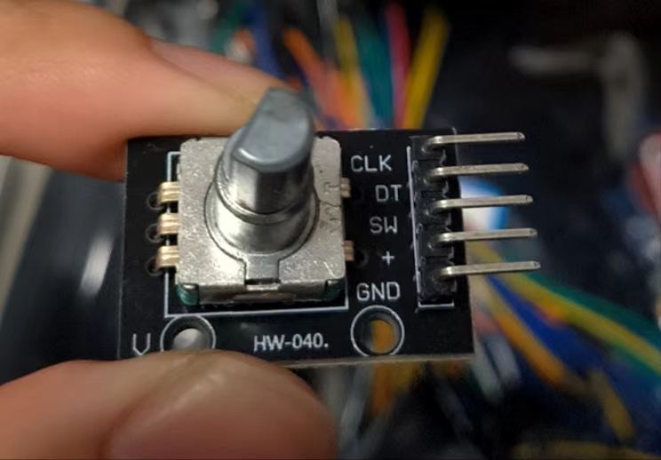
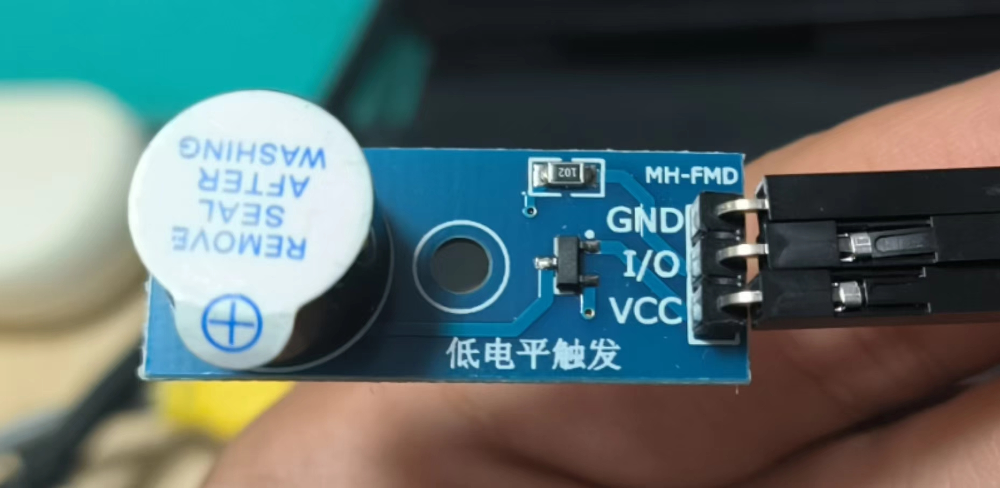

# units


## 旋钮

+ GND 接地
+ +5V 电源
+ VRx X轴信号输出
+ VRy Y轴信号输出
+ SW 按键信号输出

```cpp
int ledPin = 13;  // LED connected to digital pin 13
int inPin = 7;    // pushbutton connected to digital pin 7
int val = 0;      // variable to store the read value

void setup() {
    pinMode(ledPin, OUTPUT);  // sets the digital pin 13 as output
    pinMode(inPin, INPUT);    // sets the digital pin 7 as input
}

void loop() {
    val = digitalRead(inPin);   // read the input pin
    digitalWrite(ledPin, val);  // sets the LED to the button's value
}
```

## 电位器

+ CLK 数字信号输出
+ DAT 数字信号输出
+ SW 未知
+ \+ 电源
+ GND 接地

```cpp
int analogPin = A3; // potentiometer wiper (middle terminal) connected to analog pin 3
                    // outside leads to ground and +5V
int val = 0;        // variable to store the value read

void setup() {
    Serial.begin(9600);           //  setup serial
}

void loop() {
    val = analogRead(analogPin);  // read the input pin
    Serial.println(val);          // debug value
}

```

## 蜂鸣器

+ GND 接地
+ I/O 控制信号，HIGH/LOW
+ VCC 电源

```cpp
float duty = 0.5;

void setup() {
    pinMode(8, OUTPUT);
    Serial.begin(9600); 
}

void loop() {
    digitalWrite(8, HIGH);
    delay(20 * duty);
    digitalWrite(8, LOW);
    delay(20 * (1 - duty));
    duty += 0.001;
    if(duty > 0.9){
        duty = 0.1;
    }
    Serial.println(duty);
}
```

# Serial

## available

```cpp
int incomingByte = 0; // for incoming serial data

void setup() {
    Serial.begin(9600); // opens serial port, sets data rate to 9600 bps
}

void loop() {
    // reply only when you receive data:
    if (Serial.available() > 0) {
    // read the incoming byte:
    incomingByte = Serial.read();

    // say what you got:
    Serial.print("I received: ");
    Serial.println(incomingByte, DEC);
    }
}
``` 

